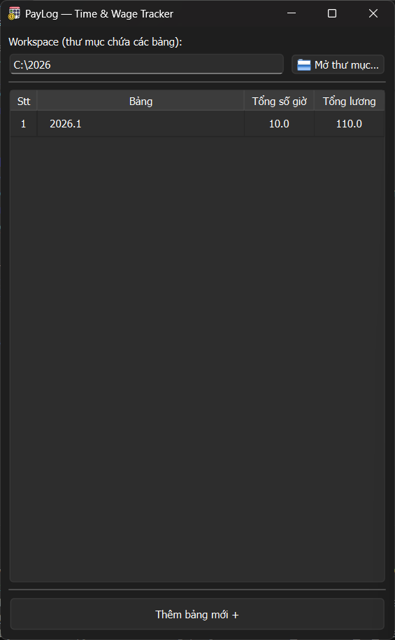
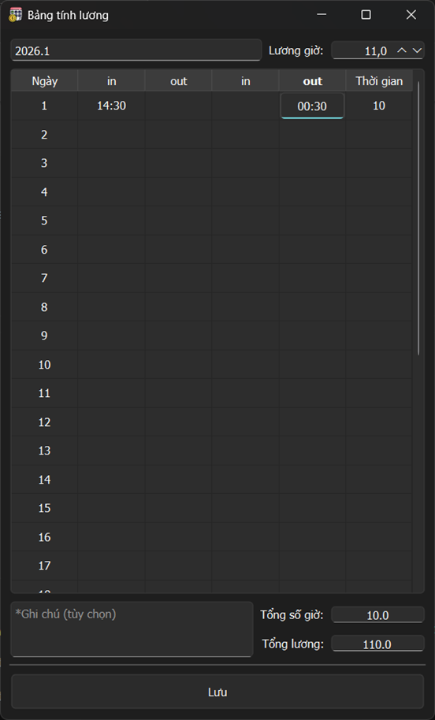

<table align="center">
  <tr>
    <td align="center">
      
       
      <em>Main window</em>
    </td>
    <td align="center">
      
       
      <em>Timesheet window</em>
    </td>
  </tr>
</table>

<h2 align="center">PayLog – Time &amp; Wage Tracker</h2>

  A lightweight desktop app for time tracking and wage calculation

---

## ✨ Features
- Manage monthly timesheets (JSON-based)
- Input working time in `HH:mm` format
- Automatic total hours calculation
- Wage calculation based on hourly rate
- Open / rename / delete timesheets
- Notes for each timesheet
- Persistent workspace using QSettings

## ▶️ How to Use
1. Launch the application
2. Select a workspace folder
3. Create or open a monthly timesheet
4. Enter daily working hours
5. Set the hourly wage
6. Click **Save** to store data

## ⚠️ Usage Notes
- Data is stored in JSON files
- Avoid manual editing of JSON files
- Backup your workspace folder regularly
- Executable may trigger antivirus warnings (PyInstaller behavior)
## 🤝 Contributing
🇬🇧 If you find bugs or have suggestions, please open an Issue: 
👉 https://github.com/duongzdvd/paylog/issues 
🇻🇳 Nếu bạn phát hiện lỗi hoặc có ý tưởng cải tiến, vui lòng tạo Issue tại link trên. 
🇰🇷 버그 신고나 개선 제안은 위 링크에서 Issue로 남겨주세요.

---
## ✨ Tính năng
- Quản lý bảng chấm công theo từng tháng (file JSON)
- Nhập giờ làm theo định dạng `HH:mm`
- Tự động tính tổng số giờ làm
- Tính tổng lương theo lương giờ
- Mở / đổi tên / xóa bảng
- Ghi chú cho từng bảng
- Nhớ thư mục làm việc lần cuối

## ▶️ Cách sử dụng
1. Chạy chương trình
2. Chọn thư mục lưu bảng chấm công
3. Tạo hoặc mở bảng theo tháng
4. Nhập giờ làm hằng ngày
5. Nhập lương giờ
6. Nhấn **Lưu** để lưu dữ liệu

## ⚠️ Lưu ý khi sử dụng
- Dữ liệu được lưu dưới dạng file JSON
- Không chỉnh sửa file JSON thủ công nếu không cần thiết
- Nên sao lưu thư mục dữ liệu định kỳ
- Bản `exe` có thể bị antivirus cảnh báo (do PyInstaller)

---
## ✨ 주요 기능
- 월별 근무 기록 관리 (JSON 파일)
- `HH:mm` 형식의 근무 시간 입력
- 총 근무 시간 자동 계산
- 시급 기반 급여 계산
- 근무표 열기 / 이름 변경 / 삭제
- 각 근무표별 메모 기능
- 마지막 작업 폴더 자동 저장

## ▶️ 사용 방법
1. 프로그램 실행
2. 근무표를 저장할 폴더 선택
3. 월별 근무표 생성 또는 열기
4. 일일 근무 시간 입력
5. 시급 입력
6. **저장** 버튼 클릭

## ⚠️ 사용 시 주의사항
- 데이터는 JSON 파일로 저장됩니다
- JSON 파일을 직접 수정하지 않는 것을 권장합니다
- 작업 폴더를 정기적으로 백업하세요
- PyInstaller로 빌드된 exe는 백신 경고가 발생할 수 있습니다
---
## 📄 License
This project is licensed under the [MIT License](LICENSE).